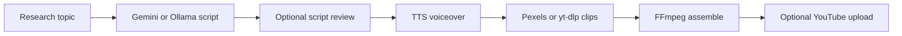
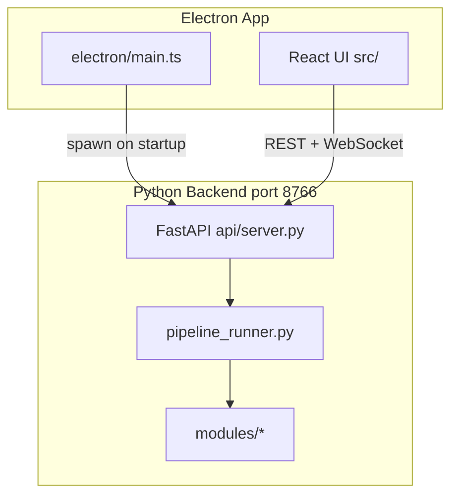

<div align="center">

# Ghost Creator AI v4.2.2

### Automated Documentary Pipeline — Electron + React GUI
### by [HunterIsLive](https://github.com/HunterisLive-1)

[](https://python.org)
[](https://nodejs.org)
[](https://www.electronjs.org)
[](https://ai.google.dev)
[](https://ffmpeg.org)
[](LICENSE)
[](https://microsoft.com)

> **Research → Script → Voice → Stock footage → FFmpeg assembly → YouTube upload.**
> Free, open source (MIT). Hindi and 8+ regional languages supported. No license key required.

</div>

---

## Table of Contents

- [What It Does](#what-it-does)
- [Architecture](#architecture)
- [Prerequisites](#prerequisites)
- [Installation](#installation)
- [Launching the App](#launching-the-app)
- [GUI User Guide](#gui-user-guide)
- [Configuration Reference](#configuration-reference)
- [TTS Backends](#tts-backends)
- [Footage Sources](#footage-sources)
- [CLI Reference](#cli-reference)
- [Building a Release](#building-a-release)
- [Project Structure](#project-structure)
- [Troubleshooting](#troubleshooting)
- [License](#license)

---

## What It Does

Ghost Creator AI automates **documentary-style videos** from a topic (or auto-discovered trending subject) through a six-step pipeline:

| Step | Module | What happens |
|------|--------|--------------|
| 1. Research | `researcher.py` | Finds trending topic (or uses your subject) |
| 2. Script | `scripter.py` | Writes narration + per-segment footage queries (Gemini or Ollama) |
| 3. Voice | `voicer.py` | Synthesizes full voiceover via OmniVoice, Edge TTS, or ElevenLabs |
| 4. Footage | `video_fetcher.py` | Downloads HD clips from Pexels (preferred) or YouTube via yt-dlp |
| 5. Assembly | `documentary_assembler.py` | FFmpeg merges clips + audio; optional burned-in subtitles (long form) |
| 6. Upload | `uploader.py` | Optional YouTube Studio upload via Playwright + Chrome profile |



**Modes**

- **SHORT** — 30–60 seconds, vertical 9:16 (default)
- **LONG** — 3 minutes up to 2 hours, horizontal 16:9, optional subtitle burn-in

Each completed run is saved under `output/<title>_<timestamp>/` with metadata, clips, and the final MP4.

---

## Architecture

The desktop app has three layers:



- **Electron** — window, native file dialogs, spawns and monitors the Python API process
- **React (Vite)** — Documentary, Upload, Settings, History tabs
- **FastAPI** — local REST + WebSocket on `127.0.0.1:8766`; wraps existing Python pipeline code
- **CLI (`main.py`)** — same pipeline without GUI (script review disabled for unattended runs)

---

## Prerequisites

### Required

| Tool | Version | Why |
|------|---------|-----|
| **Python** | 3.10 – 3.12 | Pipeline + FastAPI backend |
| **Node.js** | 18+ | Electron + React GUI |
| **Git** | Any | Clone the repository |
| **Google Chrome** | Latest | YouTube upload automation (not Chromium) |
| **FFmpeg** | Any recent | Video assembly (PATH, or auto-download on first packaged run) |
| **Gemini API key** | Free tier | Script generation (required) |

Get a Gemini key: [aistudio.google.com/app/apikey](https://aistudio.google.com/app/apikey)

### Optional

| Item | When needed |
|------|-------------|
| **Pexels API key** | Faster HD stock footage ([pexels.com/api](https://www.pexels.com/api/)) |
| **ElevenLabs API key** | If using ElevenLabs TTS |
| **OmniVoice server** | If using OmniVoice voice clone (external `.bat` / WebUI) |
| **Reference WAV** | `my_voice_reference.wav` in project root for OmniVoice clone mode |
| **Ollama** | Local script generation instead of Gemini |
| **NVIDIA GPU** | Speeds OmniVoice / long renders (not required for Edge TTS + cloud footage) |

**Python install tip (Windows):** check **Add Python to PATH** during setup.

**FFmpeg verify:**

```powershell
ffmpeg -version
```

If missing, install via `winget install ffmpeg` or run `powershell -ExecutionPolicy Bypass -File ensure_ffmpeg.ps1`.

---

## Installation

### Step 1 — Clone

```powershell
git clone https://github.com/HunterisLive-1/ghost-creator.git
cd ghost-creator
```

### Step 2 — Run setup.bat

Double-click **`setup.bat`** (Run as Administrator recommended for Windows Long Paths).

It automatically:

| Step | Action |
|------|--------|
| 1 | Enables Windows Long Path support |
| 2 | Detects Python (3.12 → 3.11 → 3.10) |
| 3 | Creates `venv\` virtual environment |
| 4 | Installs Python dependencies from `requirements.txt` |
| 5 | Optional Chatterbox TTS server setup (legacy — skip unless you use it elsewhere) |
| 6 | Installs Playwright Chromium (YouTube upload) |
| 7 | Installs FastAPI + Electron/npm dependencies |
| 8 | Optional paid TTS / image backend packages |
| 9 | Creates `config.json` (migrates legacy `.env` if found) |

First run may take 10–20 minutes depending on network speed.

### Step 3 — First-time configuration

1. Launch the app (see [Launching the App](#launching-the-app))
2. Open **Settings** tab
3. Enter your **Gemini API key**
4. Choose **TTS backend** (default: OmniVoice — requires external server, or switch to **Edge TTS** for zero setup)
5. Click **[ SAVE CONFIG ]**

Alternatively edit `config.json` in the project root, or use **OPEN IN EDITOR** for `.env.local`.

### Step 4 — OmniVoice (optional, default TTS)

If using OmniVoice voice cloning:

1. Set up the OmniVoice WebUI/server separately (external repo)
2. In Settings → OmniVoice: set server `.bat` path and reference audio WAV
3. Place `my_voice_reference.wav` in the project root (10–30 seconds of your voice)

**Quick start without OmniVoice:** Settings → TTS backend → **Edge TTS** (free, no key).

### Step 5 — YouTube upload (optional)

One-time Chrome profile setup for automated uploads:

```powershell
venv\Scripts\activate.bat
python setup_chrome_profile.py
```

Then in Settings → Chrome profiles → **+ SETUP NEW PROFILE** and sign into YouTube once.

---

## Launching the App

Activate the virtual environment first:

```powershell
venv\Scripts\activate.bat
```

| Mode | Command | Notes |
|------|---------|-------|
| **GUI (recommended)** | `npm run electron:dev` | Starts Vite + Electron; Python API auto-spawns |
| **API only (debug)** | `python -m api.server` | Listens on `http://127.0.0.1:8766/health` |
| **CLI documentary** | `python main.py` | Unattended run; no script review modal |
| **CLI with topic** | `python main.py --topic "AI in India"` | Fixed subject |
| **CLI + force upload** | `python main.py --topic "..." --upload` | Upload even if disabled in config |
| **CLI upload only** | `python main.py --from-video --video-file output/run/film.mp4` | Skip generation |

Electron waits for `GET /health` before showing the main window. If the GUI hangs on "Initializing…", check that port **8766** is free and the venv Python is available.

When the app is running, open **Settings → Open Documentation** or visit `http://127.0.0.1:8766/guide` for the full user guide. API reference (Swagger) is at `http://127.0.0.1:8766/docs`.

---

## GUI User Guide

The app opens directly to the main interface (no activation or license key).

### Documentary tab

Primary workflow for creating a new video.

**Mode**

- **SHORT** — 30–60 s, vertical 9:16
- **LONG** — 3 min – 2 hr, forces 16:9 aspect ratio

**Subject**

- Enter a topic manually, or enable **AUTO-SELECT** to let the pipeline pick a trending subject

**Duration slider**

- Adjust target length; saved per mode (short vs long)

**Language**

- Hindi, Hinglish, English, Marathi, Bengali, Gujarati, Tamil, Telugu, Odia

**Voice engine**

- **OmniVoice** — local voice clone (default)
- **ElevenLabs** — cloud premium voice
- **Edge TTS** — free Microsoft neural voices (easiest setup)

**Footage**

- **Clips:** Auto (based on duration) or fixed count (3–100)
- **Burn subtitles:** long-form only — hardcoded white bold subs at bottom

**Idea Workshop**

- Collapsible Gemini chat to brainstorm documentary ideas
- **SEND** — chat with the consultant
- **CREATE NOW** — start pipeline from the last generated plan or topic field

**Controls**

- **ROLL FILM** — start the pipeline
- **CUT** — stop after current step
- **RETRY STEP** — retry the failed step (appears on error)

**Progress**

- Six hex steps: Research → Script → Voice → Footage → Assembly → Upload
- **Cinema Terminal** — live log with INFO / SUCCESS / ERROR / WARNING tags

**Script Review (modal)**

When **Pause for script review** is enabled in Settings, the pipeline pauses after scripting:

- Edit title, full voiceover text, and per-segment footage search queries
- **Approve & Continue** — resume pipeline
- **Regenerate** — cancel and restart from script step
- **Cancel** — abort run

**AI Error Analyst**

On pipeline error, click **EXPLAIN & FIX** to get a Gemini-powered explanation from the log.

**Output**

- Finished MP4 path shown on success
- **OPEN OUTPUT FOLDER** — opens the run directory in Explorer

---

### Upload tab

Upload any local MP4 to YouTube without running the full pipeline.

1. **BROWSE** — select video file
2. Fill **title**, **description**, **tags**, **visibility** (Public / Unlisted / Private / Draft)
3. **AI FILL (Gemini)** — generate metadata from filename
4. **START UPLOAD** — streams log output in the panel

Requires a configured Chrome profile (Settings) and signed-in YouTube account.

---

### Settings tab

All persistent configuration. Click **[ SAVE CONFIG ]** after changes.

**API Keys**

- **Gemini** — required for scripting and AI features
- **ElevenLabs** — optional (More API keys section)
- **Pexels** — optional, improves footage download speed/quality

**Audio (TTS)**

- Backend selector: OmniVoice / Edge TTS / ElevenLabs
- OmniVoice sub-panel: clone vs design mode, server path, reference audio, model ID, voice design knobs
- Edge / ElevenLabs sub-panel: voice name or ID, stability sliders

**Run Behavior**

- **Pause for script review** — enable Script Review modal
- **Narration language** — default pipeline language
- **Output folder** — relative or absolute path for finished runs
- **YouTube upload** — enable/disable + visibility mode (unlisted / public / draft)
- **AI script provider** — Gemini (cloud) or Ollama (local LLM)
- **Gemini model** or **Ollama URL + model**

**Core Parameters**

- **Chrome profiles** — manage YouTube upload sessions
- **Logo watermark** — PNG/JPG overlay on final export (position, scale, opacity)

**About**

- App version and device name (informational)

**Footer**

- Path to `.env.local` — **OPEN IN EDITOR** for direct key editing

---

### History tab

Shows the **10 most recent** completed runs from the output folder.

Per run card:

- Title, timestamp, topic, description snippet, duration
- **Open Folder** — show run directory
- **Re-render (FFmpeg)** — re-assemble from saved `documentary_editor.json` + clips (if available)
- **Play Video** — open MP4 in default player

After re-render, the app can jump to **Upload** tab with the new file pre-filled.

---

## Configuration Reference

Settings are stored in **`config.json`**.

| Environment | Config location |
|-------------|-----------------|
| Development (`python` / `npm run electron:dev`) | Project root `config.json` |
| Installed app | `%LOCALAPPDATA%\GhostCreatorAI\config.json` |

Secrets can also be set in **`.env.local`** (synced on Save).

### Key settings

| Key | Default | Description |
|-----|---------|-------------|
| `api_keys.gemini` | `""` | Gemini API key (required) |
| `api_keys.pexels` | `""` | Pexels API key (optional footage) |
| `api_keys.elevenlabs` | `""` | ElevenLabs key |
| `tts.backend` | `omnivoice` | `omnivoice` \| `edge_tts` \| `elevenlabs` |
| `tts.reference_audio` | `my_voice_reference.wav` | OmniVoice clone reference |
| `tts.omnivoice_server_path` | `""` | Path to OmniVoice start script |
| `script_provider` | `gemini` | `gemini` \| `ollama` |
| `gemini_model` | `gemini-2.0-flash` | Script generation model |
| `script_review_enabled` | `true` | Pause for script review in GUI |
| `pipeline.language` | `hi` | Narration language code |
| `pipeline.output_folder` | `output` | Finished videos directory |
| `pipeline.upload_enabled` | `true` | Auto-upload after assembly |
| `pipeline.upload_mode` | `unlisted` | `unlisted` \| `public` \| `draft` |
| `documentary.length_mode` | `short` | `short` \| `long` |
| `documentary.short_duration` | `60` | Short mode seconds |
| `documentary.long_duration` | `600` | Long mode seconds |
| `documentary.burn_subtitles` | `false` | Long-form hard subs |
| `documentary.logo_enabled` | `false` | Watermark on export |
| `aspect_ratio` | `9:16` | Overridden to `16:9` for long mode |

---

## TTS Backends

Configured in Settings → Audio. Only three backends are supported:

| Backend | Cost | Quality | Setup |
|---------|------|---------|-------|
| **OmniVoice** (default) | Free (local server) | Best voice clone | External OmniVoice install + reference WAV |
| **Edge TTS** | Free | Good neural voices | None — works immediately |
| **ElevenLabs** | Paid | Premium cloud | API key + Voice ID in Settings |

OmniVoice weights and PyTorch are **not included** in the packaged app or `GhostCreatorAPI.exe`. Install OmniVoice separately (example: `D:\omnivoice\OmniVoice`), then set **Settings → OmniVoice Server Path** to that install's `run.bat`.

Language support varies by backend; the pipeline validates compatibility before synthesis.

---

## Footage Sources

Documentary mode downloads **real stock/video clips**, not AI-generated images.

Priority ([`modules/video_fetcher.py`](modules/video_fetcher.py)):

1. **Pexels API** — fast direct HD downloads (requires `api_keys.pexels`)
2. **yt-dlp fallback** — YouTube B-roll; downloads first ~90 s per query via `--download-sections`

Each script segment includes a **video search query** (editable in Script Review). Clips are trimmed and synced to narration length during assembly.

---

## CLI Reference

Headless entry point: [`main.py`](main.py)

```powershell
# Auto-topic documentary
python main.py

# Fixed topic
python main.py --topic "Future of AI in India"

# Force YouTube upload after generation
python main.py --topic "Space exploration" --upload

# Upload existing MP4 only
python main.py --from-video
python main.py --from-video --video-file "output\my_run\documentary.mp4"

# Show version
python main.py --version
```

**Notes**

- CLI runs **disable script review** automatically (no modal)
- Upload uses metadata from the run folder or `output/last_metadata.json`
- Respects `pipeline.upload_enabled` unless `--upload` flag is passed

---

## Building a Release

For developers packaging a Windows installer:

```powershell
# 1. Build Python API sidecar
build-api.bat
# Output: dist-api\GhostCreatorAPI.exe

# 2. Build Electron app + NSIS bundle
build-electron.bat
# Output: release\ (electron-builder)

# 3. Optional: Inno Setup installer
# Open installer_v4.iss in Inno Setup Compiler
# Bundles release\win-unpacked + GhostCreatorAPI.exe
```

**FFmpeg on installed builds:** not bundled in the installer (keeps size small). On first run, FFmpeg is downloaded to:

`%LOCALAPPDATA%\GhostCreatorAI\ffmpeg`

See [`core/ffmpeg_bootstrap.py`](core/ffmpeg_bootstrap.py).

---

## Project Structure

```
ghost-creator/
├── electron/                 # Electron main process + Python bridge
│   ├── main.ts
│   ├── preload.ts
│   └── python-bridge.ts
├── src/                      # React UI (Vite)
│   ├── App.tsx
│   ├── tabs/                 # Documentary, Upload, Settings, History
│   ├── components/           # ScriptReviewModal, HexProgress, etc.
│   └── api/client.ts         # REST + WebSocket client
├── api/                      # FastAPI local backend
│   ├── server.py             # uvicorn entry (port 8766)
│   └── routes/               # config, pipeline, upload, history, workshop
├── core/
│   ├── config_manager.py     # config.json read/write
│   ├── pipeline_runner.py    # 6-step documentary orchestrator
│   └── ffmpeg_bootstrap.py   # First-run FFmpeg download
├── modules/
│   ├── researcher.py         # Trending topic finder
│   ├── scripter.py           # Script + metadata generation
│   ├── voicer.py             # TTS dispatcher
│   ├── video_fetcher.py      # Pexels + yt-dlp footage
│   ├── documentary_assembler.py  # FFmpeg final assembly
│   └── uploader.py             # YouTube Playwright upload
├── backends/
│   ├── tts/                  # omnivoice, edge_tts, elevenlabs
│   └── image/                # gemini_imagen (thumbnails/auxiliary)
├── main.py                   # CLI entry point
├── setup.bat                 # One-click dev setup
├── build-api.bat             # PyInstaller API build
├── build-electron.bat        # Full Electron release build
├── installer_v4.iss          # Inno Setup installer script
├── package.json              # Node/Electron scripts
├── requirements.txt          # Python dependencies
├── config.json               # User settings (auto-created, gitignored)
└── LICENSE                   # MIT
```

---

## Troubleshooting

### GUI stuck on "Initializing Neural Interface…"

```powershell
venv\Scripts\activate.bat
pip install -r requirements.txt
npm install
python -m api.server
# Visit http://127.0.0.1:8766/health — should return {"ok": true, ...}
npm run electron:dev
```

Ensure nothing else is using port **8766**.

### FFmpeg not found

```powershell
winget install ffmpeg
ffmpeg -version
```

Or for dev only:

```powershell
powershell -ExecutionPolicy Bypass -File ensure_ffmpeg.ps1
```

### OmniVoice / voice step fails

- Confirm OmniVoice server is running
- Check **Settings → OmniVoice server path** points to the correct `.bat`
- Verify `my_voice_reference.wav` exists, or switch to **Edge TTS** for a quick test

### Footage download slow or failing

- Add a **Pexels API key** in Settings (free)
- yt-dlp fallback requires internet; some queries may fail if no matching YouTube clip exists
- Retry with **RETRY STEP** on the Documentary tab

### YouTube upload fails

- Use real **Google Chrome** (not Edge Chromium-only builds for Playwright)
- Run `python setup_chrome_profile.py` and complete sign-in once
- Check the correct Chrome profile is selected in Settings
- Ensure upload is enabled: Settings → YouTube upload

### `config.json` missing

```powershell
venv\Scripts\activate.bat
python -c "from core.config_manager import config; config.save()"
```

Or re-run `setup.bat`.

### Gemini / script errors

- Verify `api_keys.gemini` in Settings
- Check API quota at [aistudio.google.com](https://aistudio.google.com)
- For local scripts, ensure Ollama is running and reachable at the URL in Settings

### `No module named 'X'`

```powershell
venv\Scripts\activate.bat
pip install -r requirements.txt
```

---

## License

**MIT License** — free and open source. No activation or license key required.

See [LICENSE](LICENSE) for the full text.

---

<div align="center">

**Made with care by [HunterIsLive](https://github.com/HunterisLive-1)**

*Ghost Creator AI — Automate your documentaries. Stay Ghost. Stay Consistent.*

**[GitHub Repository](https://github.com/HunterisLive-1/ghost-creator)**

</div>
