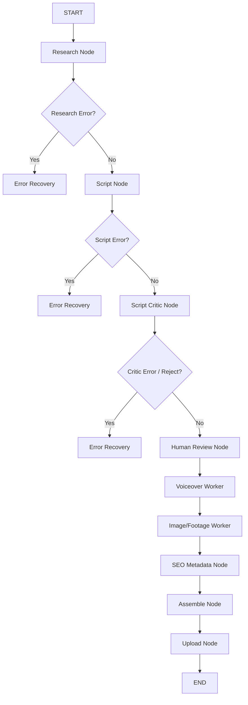

<div align="center">


# Ghost Creator AI v4.3.0

### Stateful Agentic Documentary Pipeline — Electron + React GUI
### by [HunterIsLive](https://github.com/HunterisLive-1)

[](https://python.org)
[](https://nodejs.org)
[](https://www.electronjs.org)
[](https://ai.google.dev)
[](https://ffmpeg.org)
[](LICENSE)
[](https://microsoft.com)

> **Research → Script → Critic → Review → Voice → Footage → Assembly → Upload.**
> Stateful LangGraph orchestration with self-healing, SQLite checkpoint database, and progress fallback.
> Free, open source (MIT). Hindi and 8+ regional languages supported. No license key required.

</div>

---

## Table of Contents

- [What It Does](#what-it-does)
- [Agentic Architecture (LangGraph)](#agentic-architecture-langgraph)
- [Resuming & SQLite Checkpoints](#resuming--sqlite-checkpoints)
- [Error Recovery & Self-Healing](#error-recovery--self-healing)
- [HTTP Progress Polling Fallback](#http-progress-polling-fallback)
- [Prerequisites](#prerequisites)
- [Installation](#installation)
- [Launching the App](#launching-the-app)
- [GUI User Guide](#gui-user-guide)
- [Configuration Reference](#configuration-reference)
- [TTS Backends](#tts-backends)
- [Footage Sources](#footage-sources)
- [CLI Reference](#cli-reference)
- [Building a Release](#building-a-release)
- [Project Structure](#project-structure)
- [Troubleshooting](#troubleshooting)
- [License](#license)

---

## What It Does

Ghost Creator AI automates **documentary-style short and long videos** from a simple topic through a stateful agentic pipeline:

| Step | Node | What happens |
|------|------|--------------|
| **1. Research** | `research_node` | Discovers trending news/feed topics, or queries Tavily to gather facts |
| **2. Script** | `script_node` | Drafts a natural TTS script, B-Roll prompts, title, and metadata |
| **3. Critic** | `script_critic_node` | Analyzes script hook, retention, and tone. Flags `needs_work` if score < threshold |
| **4. Review** | `human_review_node` | Pauses for human editing and approval (optional) |
| **5. Voice** | `voiceover_worker_node` | Synthesizes voiceover narration using OmniVoice (local), Edge, or ElevenLabs |
| **6. Image/Footage** | `image_worker_node` / `clip_prep` | Fetches stock footage from Pexels, falls back to yt-dlp, or generates AI images |
| **7. Assembly** | `assemble_node` | Concat clips and muxes with voiceover and background music via FFmpeg |
| **8. Upload** | `upload_node` | Logs into YouTube Studio via Playwright using a saved Chrome profile |



**Modes:**
* **SHORT** — 30–60 seconds, vertical 9:16 (default).
* **LONG** — 3 minutes up to 2 hours, horizontal 16:9, with automated subtitle burn-in.

---

## Agentic Architecture (LangGraph)

The backend has transitioned from a sequential script model to a **stateful graph network** powered by **LangGraph**. The app now operates with a clear boundary between the Electron front-end shell and the background Python service:

* **Stateful Graph state**: Every node accepts and yields a shared dictionary state containing the script draft, generated audio paths, downloaded clips, compile paths, and error lists.
* **Intelligent Routing**: Conditional edges route execution dynamically. If a node fails, it redirects to the `error_recovery_node` instead of immediately crashing.
* **Separation of Concerns**: Nodes operate asynchronously and report progress to a central event broadcaster.

---

## Resuming & SQLite Checkpoints

By compiling our graph with an **SQLite Checkpointer** (`SqliteSaver`), all runs are tracked statefully in the database:
* **Database Path**: `ghost_runs.db` (created automatically in the project folder).
* **Checkpoint Resuming**: The graph saves state snapshots before and after every node. If a run is interrupted (e.g. system crash, manual shutdown, or human review pause), it resumes precisely from the last successful node using its `thread_id` (e.g. `run_{run_id}_{uuid}`).
* **Persistent States**: Re-triggering retries or editing in the review modal updates the state directly on the SQLite checkpointer and continues.

---

## Error Recovery & Self-Healing

The pipeline is equipped with agentic error recovery features to maintain uptime:
* **Script Critic**: Runs scripts through an LLM evaluation checklist (Hook, Emotional Hook, Pacing, Retention). If the critic yields a score below the auto-approve threshold, it routes back to regenerate the script with feedback.
* **Self-Healing Node**: If a network request, API limit, or generation fails, the graph routes to `error_recovery_node`. It inspects `last_failed_node` and its error trace to make a decision:
  1. **Retry**: Attempt the same node again (up to max attempts).
  2. **Fallback**: Swap providers (e.g., fall back to Stock footage if AI image generation fails).
  3. **Skip**: Skip non-critical nodes (e.g. bypass SEO optimization or YouTube upload if they fail).

---

## HTTP Progress Polling Fallback

To bypass Windows-specific WebSocket connectivity issues (where `localhost` resolves to IPv6 `::1` while uvicorn binds to IPv4 `127.0.0.1`), the app implements a robust dual-channel pipeline updater:
* **Monotonic Sequence Buffer**: The backend's `ProgressBroadcaster` maintains a thread-safe sliding history of events with sequence IDs (`_seq`).
* **Active Polling Fallback**: The React hook `usePipelineWebSocket` monitors the WebSocket connection. If it disconnects or fails to establish, the hook seamlessly falls back to polling `/api/pipeline/progress?after=N`.
* **State Deduplication**: The sequence numbers ensure messages are never duplicated, regardless of which network interface delivers them.

---

## Prerequisites

### Required
* **Python 3.10 – 3.12** (Windows installer will run within a packaged environment).
* **Node.js 18+** (for dev/build setup).
* **Google Chrome** (required for automated YouTube upload).
* **FFmpeg** (Cached in `%LOCALAPPDATA%/GhostCreatorAI/ffmpeg/` automatically on packaged launch).
* **Gemini API key** (Get free key: [aistudio.google.com/app/apikey](https://aistudio.google.com/app/apikey)).

---

## Installation

### Dev Setup
1. **Clone the repository**:
   ```powershell
   git clone https://github.com/HunterisLive-1/ghost-creator.git
   cd ghost-creator
   ```
2. **Run the installer script**:
   Double click `setup.bat` (Run as Administrator recommended for Long Path support). It will configure the virtual environment, install requirements, and set up npm modules.

---

## Launching the App

1. **Activate Virtual Environment**:
   ```powershell
   call venv\Scripts\activate.bat
   ```
2. **Launch Developer GUI**:
   ```powershell
   npm run electron:dev
   ```
3. **Launch CLI Mode (Unattended)**:
   ```powershell
   python main.py --topic "OpenAI reasoning models" --upload
   ```

---

## GUI User Guide

### 1. Documentary Tab
The command center for generating videos. Choose your mode (Short vs Long), input a topic, choose language, audio engine, and hit **ROLL FILM**.

* **Review Modal**: Appears when the script is generated. You can modify narration lines, adjust video clip queries, and click **Approve** to resume the graph.
* **Cinema Terminal**: Displays real-time updates from nodes via WS/HTTP polling.

### 2. Upload Tab
Provides direct, stand-alone video upload capabilities. Fill in metadata (or let Gemini **AI Fill** it based on file name) and launch.

### 3. Settings Tab
Allows configuration of keys, model choices (Gemini vs local Ollama), watermark overlays, and active YouTube profiles.

### 4. History Tab
Displays the last 10 runs. Allows re-opening folders or using **Re-render** to rebuild projects from the stored `documentary_editor.json`.

---

## Configuration Reference

Settings are stored in `config.json` (development) or `%LOCALAPPDATA%\GhostCreatorAI\config.json` (installed app).

| Config Key | Default | Description |
|------------|---------|-------------|
| `api_keys.gemini` | `""` | Google Gemini key |
| `api_keys.pexels` | `""` | Pexels API key (stock footage) |
| `tts.backend` | `"omnivoice"` | `omnivoice` \| `edge_tts` \| `elevenlabs` |
| `script_provider` | `"gemini"` | `gemini` \| `ollama` |
| `pipeline.language` | `"hi"` | Language code for voice and script |
| `pipeline.error_recovery_enabled` | `true` | Enables LangGraph self-healing routing |
| `documentary.playback_speed` | `1.0` | Target assembly speed (adjust in editor) |

---

## TTS Backends

1. **OmniVoice (Default)**: Premium local voice cloning. Set path to `run.bat` in settings, and place a reference clip as `my_voice_reference.wav` in the project root.
2. **Edge TTS**: Easiest zero-configuration backend. High-quality Microsoft neural voices.
3. **ElevenLabs**: Premium cloud generation. Requires API key in settings.

---

## Footage Sources

Video footage mode pulls real video files:
* **Pexels API**: Direct high-quality stock downloads (free key recommended).
* **yt-dlp**: Automated B-Roll search on YouTube. Trims clip intervals to fit narration sections.
* **Gemini Imagen**: (Fallback) Generates image slides if video mode is disabled.

---

## CLI Reference

Run `main.py` directly for automated, headless execution:
```powershell
python main.py --topic "Geopolitics" --upload
python main.py --from-video --video-file "C:\videos\film.mp4"
```

---

## Building a Release

If you want to package the app into a standalone installer:

1. **Compile API binary**:
   ```powershell
   build-api.bat
   ```
   Uses `GhostCreatorAPI.spec` to package Python, LangGraph, and libraries into a windowless sidecar inside `dist-api/GhostCreatorAPI/`.

2. **Package Electron project**:
   ```powershell
   build-electron.bat
   ```
   Bundles Vite frontend and packages the app using `electron-builder` to the `release/` directory.

3. **Inno Setup Installer**:
   Open `installer_v4.iss` in the Inno Setup Compiler. Compiles the full installer EXE including the Electron binaries and Python API sidecar.

---

## Project Structure

```
ghost-creator/
├── electron/                 # Electron main process + Python bridge
├── src/                      # React UI (Vite)
├── api/                      # FastAPI REST + WS controllers
├── graph/                    # Stateful LangGraph definition
│   ├── nodes/                # Node handlers (research, voice, assemble)
│   ├── pipeline.py           # Graph compiler with SQLiteSaver
│   └── state.py              # State schema
├── core/                     # Configuration and FFmpeg bootstrap
├── modules/                  # Lower-level modules (research, assembler)
├── backends/                 # TTS and Image generation plugins
├── main.py                   # CLI entry point
├── build-api.bat             # Compiles Python API with PyInstaller
├── build-electron.bat        # Compiles Electron/React dist files
└── installer_v4.iss          # Inno Setup installation compiler script
```

---

## Troubleshooting

### App Stuck at "Initializing Neural Interface..."
1. Check if another process is holding port **8766**.
2. Run `python -m api.server` manually and check for any missing libraries.

### FFmpeg Errors
Run `ensure_ffmpeg.ps1` in PowerShell to download and register FFmpeg to your path, or let the app download it automatically on launch.

---

## License

MIT License. Free to use, modify, and distribute. Stay Ghost. Stay Consistent.

---

<div align="center">

**Made with care by [HunterIsLive](https://github.com/HunterisLive-1)**

</div>
